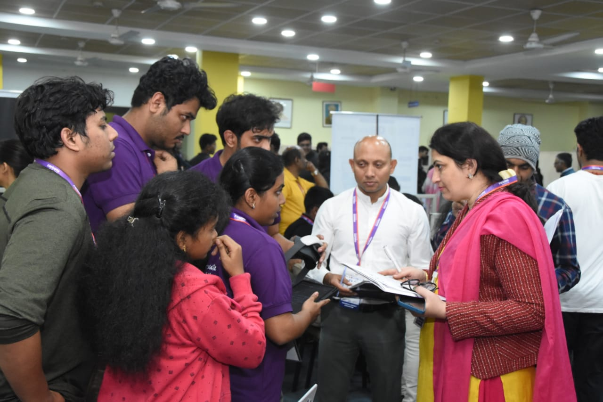

# 🎉 **WE WON the Smart India Hackathon 2024!** 🏆

I'm beyond excited to share that our team, **Smart Smurfs 561**, has **won** the **Smart India Hackathon 2024**! 🏅

We took on the challenge of **Voice-Controlled Gaming Tools for Enhanced Learning in the Skill Ecosystem (PS ID: 1779)** under the **Ministry of Skill Development and Entrepreneurship (MSDE)** in the **Toys & Games** category. 

The hackathon took place from **December 11-12, 2024** at **G H Raisoni College of Engineering, Nagpur**, and it was absolutely unforgettable!

## 💡 **What We Built**

Our solution was all about **Virtual Reality healthcare training** in **Unity**. We created modules for:

- **CPR Training**:
  - Chest compressions
  - AED usage
  - Oxygen mask handling
- **Surgical Training**:
  - Suturing
  - Bandaging

Plus, we made **Medibot**, an AI assistant powered by **Machine Learning** and **Python** that helps:

- Assess user skills
- Aid decision-making
- Generate performance reports

And of course, there’s our super useful **Dashboard** with:

- **Live streaming**
- **ECG wave analysis (PQRST)**
- Health metrics like **respiration rate, pulse, SpO₂**, and performance insights.

  
  

### **Our Goal**
We wanted to deliver immersive VR training for healthcare professionals and help boost skills using **AI-powered modules**.

## ⏳ **The Hackathon Journey**

The **36-hour hackathon** was a rollercoaster of ideas, prototyping, and pushing ourselves to the limit. But in the end, we pulled through with a solution we’re all super proud of. 💪

Presenting our project to the jury was a huge moment for us, and it felt incredible to see everything come together!

## 🔥 **The Comeback**

This win means even more to us because, in **2023**, we came in **Runner-Up**. That setback only made us stronger and more determined to come back with an even better solution this year!

  

## 🙏 **Shoutouts & Thanks**

### **Team Leader:**
- **Harini V** – Your leadership and vision led us to this victory! 💫

### **Team Members:**
- @Bramarambika
- @KrithikRaghav
- @Mohamed Suhail
- @Ratnesh (me)
- @Sakthisree

We couldn’t have done it without your amazing creativity and teamwork! 🙌

### **Mentors:**
A huge thanks to our mentors @ and @ for your endless support and guidance. You’ve been key to our success! 🌟

### **Organizers & Facilities:**
Special shoutout to **G H Raisoni College of Engineering, Nagpur**, for their fantastic facilities and seamless organization. You made our experience so smooth! 🙏

### **Support:**
Big thanks to @Lelin, @Sairam Techno Incubator Foundation, @Swagata Sarkar, HoD of AI & Data Science, and @Raja, Principal at Sri Sairam Engineering College, for always having our backs. ❤️

## 🚀 **Looking Ahead**

This win is just the beginning for us! It's motivated us to keep innovating, facing challenges head-on, and making a real difference. 

> “The future belongs to those who believe in the beauty of their dreams.”

Here’s to many more adventures ahead! 🌟

---

### #SmartIndiaHackathon #Innovation #Teamwork #Success #AI #VR #Healthcare #Resilience
